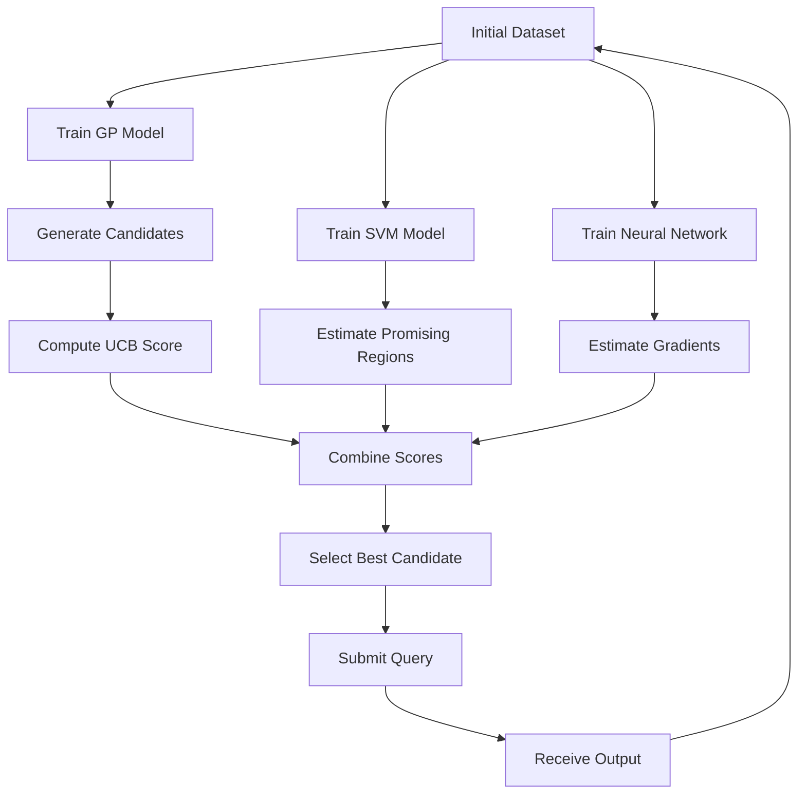

# Imperial-Capstone

## 🔹 Section 1: Project Overview

### Black-Box Optimisation (BBO) Capstone Project

This project focuses on solving a Black-Box Optimisation (BBO) challenge, where the goal is to maximise a set of unknown functions using limited observations. The internal structure of these functions is hidden, meaning decisions must be made based only on input-output interactions.

The core objective is to iteratively propose optimal input values (queries) that lead to the highest possible output. Each iteration provides new feedback, allowing the strategy to evolve over time.

### Why is this relevant in real-world ML?

This challenge closely mirrors real-world scenarios where:
- the underlying system is unknown or too complex to model directly  
- evaluations are expensive or limited (e.g. A/B testing, hyperparameter tuning, drug discovery)  
- decisions must be made under uncertainty  

Instead of relying on full knowledge, we use data-driven exploration and intelligent search strategies.

### Career Relevance

This project strengthens key data science skills such as:
- optimisation under uncertainty  
- iterative model improvement  
- balancing exploration vs exploitation  
- applying ML techniques in real-world constraints  

---

## 🔹 Section 2: Inputs and Outputs

### Inputs

Each function receives a vector of input values:
x1-x2-x3-...-xn

Where:
- each value is between 0 and 1  
- each value is formatted to 6 decimal places  
- the number of dimensions varies per function (2D → 8D)

**Example:**
0.123456-0.654321

### Outputs

For each submitted input, the system returns:
- a single numerical output value representing performance  

This output is used to:
- update the dataset  
- guide the next optimisation step  

---

## 🔹 Section 3: Challenge Objectives

The objective of this project is to:

👉 **Maximise the output of each black-box function**

### Key Constraints

- Limited number of queries per function  
- No knowledge of the underlying function  
- Sequential feedback (one new data point per round)  
- Increasing dimensionality (from 2D to 8D)  

### Challenges

- Identifying promising regions with limited data  
- Avoiding local optima  
- Managing uncertainty in high-dimensional spaces  
- Designing strategies that improve over time  

---

## 🔹 Section 4: Technical Approach

This project follows an iterative optimisation strategy, evolving across multiple rounds.

### Week 1 – Heuristic Search
- Local exploration around the best observed point  
- Simple and fast, but limited understanding of the global structure  

### Week 2 – Bayesian Optimisation (GP)
- Introduced Gaussian Process (GP)  
- Used UCB (Upper Confidence Bound)  
- Balanced exploration and exploitation  

### Week 3 – Hybrid Model (GP + SVM)
- Added SVM classifier to separate good vs bad regions  
- Improved decision-making using probability of promising regions  

### Week 4 – Neural Network + Gradients
- Introduced neural network surrogate  
- Used gradient-based search  
- Extracted feature importance  

### Week 5 – Deep Hybrid Strategy
- Deeper neural network (feature hierarchy learning)  
- Multi-start gradient ascent  
- Feature-aware optimisation  
- Combined GP + SVM + NN + gradient signals  

### Week 6 – CNN-Inspired Optimisation

* Applied concepts from Convolutional Neural Networks (CNNs)
* Enhanced feature extraction and pattern recognition
* Improved candidate generation using deeper surrogate learning

### Week 7 – Hyperparameter Optimisation

* Tuned model hyperparameters
* Evaluated exploration versus exploitation sensitivity
* Improved model stability and convergence

### Week 8 – Prompting and LLM-Inspired Search

* Investigated structured decision-making strategies
* Introduced attention-inspired weighting mechanisms
* Reduced noise in candidate selection

### Week 9 – Scaling and Emergent Behaviour

* Analysed optimisation performance as dataset size increased
* Introduced adaptive exploration policies
* Evaluated robustness and generalisation

### Week 10 – Transparency and Interpretability

* Added detailed decision logging
* Improved explainability of optimisation choices
* Enhanced reproducibility through model documentation

### Week 11 – Clustering-Based Optimisation

* Applied K-Means clustering
* Identified high-performing regions of the search space
* Used cluster centroids to guide exploration

### Week 12 – PCA-Guided Search

* Applied Principal Component Analysis (PCA)
* Reduced redundancy in the search process
* Focused optimisation on high-variance directions

### Week 13 – Reinforcement Learning Inspired Strategy

* Introduced Multi-Armed Bandit concepts
* Adaptive exploration–exploitation policies
* Feedback-driven optimisation inspired by Q-learning and RL principles

---

## 🔹 Section 5: Exploration vs Exploitation Strategy

The approach dynamically balances:

### Exploitation
- Focus on high-performing regions  
- Local refinement around best points  

### Exploration
- Sampling uncertain or new regions  
- Avoids getting stuck in local optima  

---

## 🔹 Neural Network & Hyperparameter Insights

### Role of Neural Networks

Neural networks were used as surrogate models to capture complex non-linear relationships, especially in higher dimensions.

They enabled:
- better pattern learning  
- gradient-guided optimisation  
- improved search efficiency  

---

### Hyperparameter Effects

Key parameters that influenced performance:
- hidden layers → control model complexity  
- iterations → affect convergence  
- activation function (ReLU) → enables non-linearity  
- scaling → improves stability  

---

### Gradient-Based Optimisation

The neural network was used to:
- estimate gradients  
- guide search direction  
- perform gradient ascent toward better regions  

---

### Feature Importance

Feature importance was estimated using:
- input sensitivity (gradient magnitude)

This helped:
- identify key variables  
- focus exploration on important dimensions  

---

## 🔹 Repository Structure
notebooks/ → weekly capstone notebooks
data/ → input/output datasets
results/ → submission logs and outputs
images/ → plots and diagrams
docs/ → additional notes
README.md → project documentation

---

## 🔹 Optimisation Workflow

 

## Project Documentation

### Datasheet
The datasheet describes:
- dataset motivation
- collection process
- preprocessing
- intended use
- limitations
- maintenance

📄 [View Datasheet](docs/DATASHEET.md)

## 🔹 Results and Key Learnings

Throughout 13 optimisation rounds, the strategy evolved from simple heuristic search to a hybrid framework combining:

* Gaussian Processes (GP)
* Bayesian Optimisation
* Support Vector Machines (SVM)
* Neural Network Surrogates
* CNN-inspired learning
* Clustering (K-Means)
* Principal Component Analysis (PCA)
* Reinforcement Learning inspired policies

Key lessons learned:

* Exploration is critical during early optimisation stages.
* Exploitation becomes increasingly valuable as data accumulates.
* Combining multiple surrogate models generally outperformed single-model approaches.
* Clustering and PCA helped reveal hidden structure in the search space.
* Adaptive strategies consistently produced better results than static approaches.

The project demonstrated how machine learning can be applied to optimise unknown systems under uncertainty using limited observations.

## 🔹 Non-Technical Summary

This project explores how artificial intelligence can learn to find better solutions when the underlying system is unknown. Over multiple rounds, different machine learning techniques were used to analyse previous results and decide where to search next. The approach gradually evolved from simple trial-and-error methods to advanced optimisation techniques using statistical models, neural networks, clustering and reinforcement learning concepts. The project demonstrates how data-driven decision-making can improve performance over time, even when very little information is available about the problem being solved.

### Model Card
The model card describes:
- optimisation framework
- intended use
- performance
- assumptions
- limitations
- ethical considerations

📄 [View Model Card](docs/MODEL_CARD.md)

The datasheet explains the purpose, structure, collection process, preprocessing, intended uses and limitations of the query-history dataset.

The model card explains the optimisation approach, intended use, strategy evolution, performance indicators, assumptions, limitations and ethical considerations.
